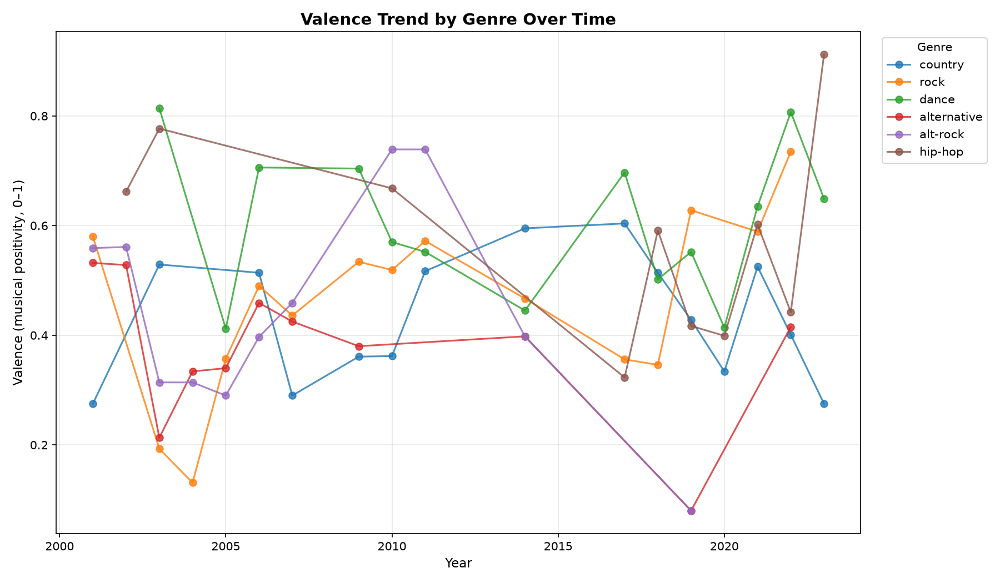

# 🎵 Spotify Mood Ring

**Does popular music get happier or sadder over time — and does it differ by genre?**

This project scrapes Billboard's Year-End Hot 100 chart data across multiple years, joins it with public audio-feature data (valence, energy, tempo, danceability), and analyzes how musical "mood" shifts year-over-year and across genres.

Built as a hands-on project to practice: Python fundamentals, NumPy vectorized operations, Pandas DataFrames, boolean/filtering logic, web scraping, and reshaping/pivoting data.

---




## 🎯 Project Questions

- How does average song "valence" (musical positivity) trend year-over-year within each genre?
- Which genres show the widest mood swings across different years?
- Are there outlier year-genre combinations that break the typical trend (e.g. an unusually happy or somber year for a genre)?
- Is there a correlation between a song's tempo/energy/danceability and its valence?

*Note: this project originally aimed at weekly seasonal analysis, but pivoted to annual Billboard Year-End data after determining that live weekly Spotify chart scraping wasn't feasible (see Data Sources below). The questions above reflect what the final annual dataset supports.*

## Findings

1. **Valence trend by genre:** British valence decrease from 0.25 in 2001 to 2022, while country stayed relatively flat across the same period.
2. **Widest mood swings:** synth-pop had the widest year-to-year valence swings (std ≈ 0.333).
3. **Outliers:** 85 year-genre combinations were flagged as statistical outliers. The most extreme was indie in 2011 (valence 0.965) — a notably upbeat year compared to that genre's typical range.
4. **Correlations:** Valence shows a moderate positive correlation with danceability (r=0.34) — happier songs tend to be more danceable — a weaker positive link with energy (r=0.21), and a moderate negative correlation with tempo (r=-0.31), suggesting faster songs trend slightly less positive.

---


## 📁 Repository Structure

```
spotify-mood-ring/
├── data/
│   ├── raw/                 # Untouched scraped HTML/JSON and downloaded audio-feature CSVs
│   └── processed/           # Cleaned, merged, analysis-ready DataFrames (parquet/csv)
│
├── notebooks/               # Exploratory analysis, step-by-step, one notebook per project phase
│   ├── 01_scrape_explore.ipynb
│   ├── 02_clean_merge.ipynb
│   ├── 03_filtering_questions.ipynb
│   ├── 04_pivot_seasonal_mood.ipynb
│   └── 05_numpy_stats_plots.ipynb
│
├── src/                      # Reusable code, imported by notebooks/scripts (not copy-pasted)
│   ├── __init__.py
│   ├── scraper.py            # Chart-scraping functions (parse_chart_page, retry logic, etc.)
│   ├── clean.py              # Normalization/cleaning functions (dedupe, name matching)
│   └── analysis.py           # Pivoting, rolling stats, z-scores, correlation helpers
│
├── tests/                    # Unit tests for src/ functions
│   ├── __init__.py
│   └── test_clean.py
│
├── outputs/                  # Saved charts/plots (PNG) for the README or portfolio writeup
│
├── .gitignore
├── requirements.txt
└── README.md
```

---

## 🛠️ Setup

```bash
git clone <your-repo-url>
cd spotify-mood-ring
python -m venv venv
source venv/bin/activate       # Windows: venv\Scripts\activate
pip install -r requirements.txt
```

---

## 🚀 Usage

1. **Scrape chart data** (fills `data/raw/`)
   ```bash
   python -m src.scraper
   ```
2. **Clean & merge with audio features** (fills `data/processed/`)
   ```bash
   python -m src.clean
   ```
3. **Run the analysis** (computes rolling trends, outliers, correlations, and saves the chart)
   ```bash
   python -m src.analysis
   ```
4. **Or explore step-by-step in notebooks**, in order, starting with `notebooks/01_scrape_explore.ipynb`

---

## 📊 Skills Practiced

| Skill | Where |
|---|---|
| Python fundamentals (functions, control flow) | `src/scraper.py`, `src/clean.py` |
| Web scraping / data extraction | `src/scraper.py`, `notebooks/01` |
| Pandas Series/DataFrame basics | `notebooks/02`, `src/clean.py` |
| Filtering & boolean indexing | `notebooks/03` |
| Reshaping / pivoting (`pivot_table`, `melt`) | `notebooks/04`, `src/analysis.py` |
| NumPy vectorized ops (rolling avg, z-scores, correlation) | `notebooks/05`, `src/analysis.py` |

---

## 📈 Sample Finding

Acoustic tracks showed the widest year-to-year valence swings (z-scores over 1.0 in multiple years), while alt-rock stayed comparatively stable across the same period. Valence correlates moderately with danceability (r=0.33) but has a weak negative relationship with tempo (r=-0.32), suggesting faster songs trend slightly less "positive" on average.

---

## 📄 Data Sources

- **Chart data:** Wikipedia's "Billboard Year-End Hot 100 singles" pages (one static, server-rendered page per year — see below for why the original weekly Spotify-chart scraping idea wasn't achievable with `requests`/`BeautifulSoup`, since Spotify's charts are loaded client-side via a private API)
- **Audio features:** a public Kaggle [Spotify Tracks Dataset | Audio Features](https://www.kaggle.com/datasets/saichaitanyareddyai/spotify-tracks-dataset-audio-features) dataset, downloaded once and joined to the scraped chart data by normalized song title + artist name

---

## 🎧 Fun Fact

I love music — especially the **phonk** genre. My very first ever project was actually an open-source music player called [Phonq](https://github.com/hexsyro/Phonq). This project brings that same love of music into a data science lens.

---

## 🔭 Possible Extensions

- Add sentiment analysis on lyrics (would introduce basic NLP)
- Pull monthly/weekly chart data from a source that supports it, to revisit the original seasonal-mood question
- Add a chart-longevity metric (e.g. weeks on chart) to test tempo/energy vs. longevity
- Build a small dashboard (Streamlit) to explore mood-by-genre interactively